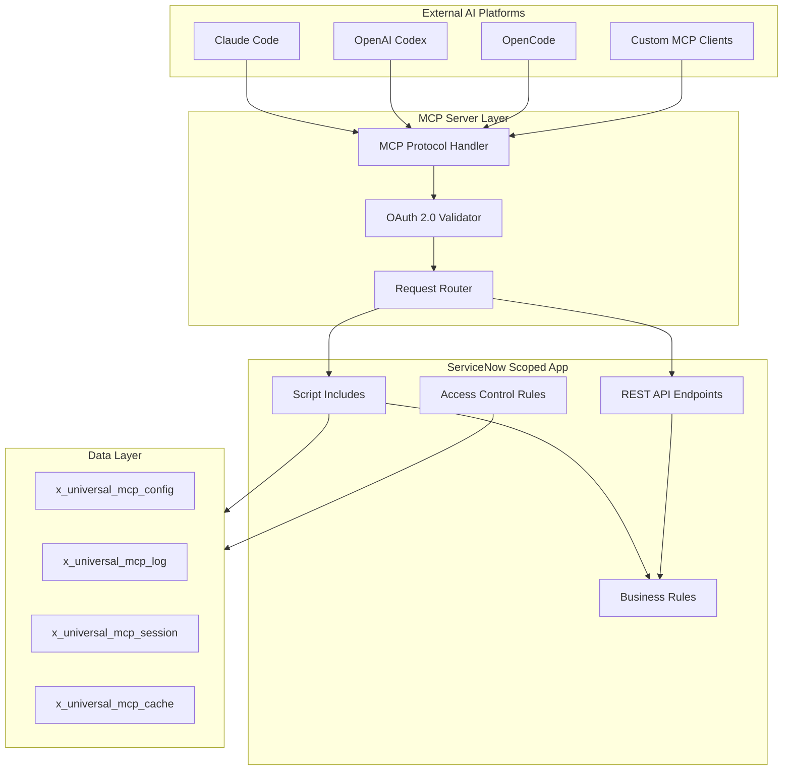
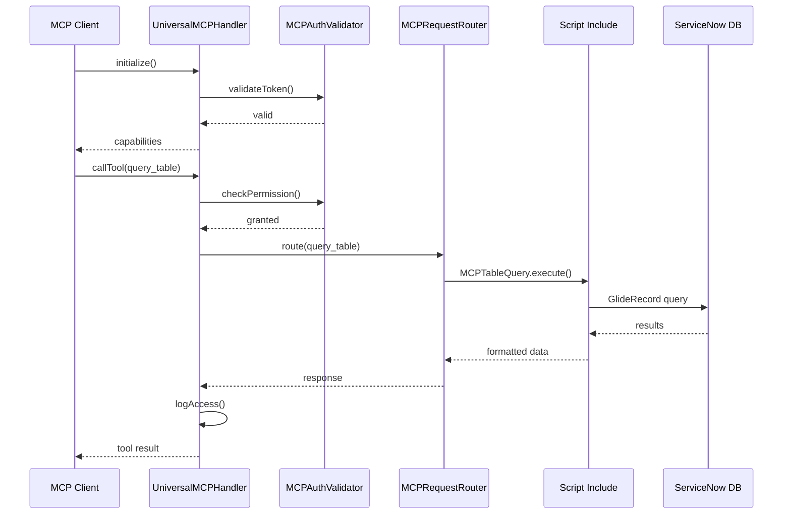

# ServiceNow Universal MCP

**Scope Prefix:** `x_universal_mcp`
**Repository:** `vladarchitectservicenow-oss/servicenow-universal-mcp`
**License:** AGPL-3.0-only
**Author:** Vladimir Kapustin
**Version:** 1.0.0
**Last Updated:** 2026-06-01

---

## Executive Summary

ServiceNow Universal MCP is an enterprise-grade ServiceNow scoped application designed to bridge the gap between external AI agents, chatbots, and automation platforms with ServiceNow instance data and workflows. By implementing the Model Context Protocol (MCP) server specification, this application enables AI assistants like Claude Code, OpenAI Codex, and OpenCode to discover and invoke ServiceNow capabilities through a unified, standardized interface.

This application was built specifically for the Australia-era ServiceNow platform, leveraging the latest APIs, OAuth 2.0 authentication, and scoped application security models to deliver a seamless, native experience within any ServiceNow instance. The architecture eliminates the need for custom integrations per AI platform, reducing integration time from weeks to hours while maintaining enterprise security standards.

Organizations deploying ServiceNow Universal MCP gain immediate benefits: standardized AI agent connectivity, OAuth 2.0 secured access, comprehensive audit logging, rate limiting to prevent abuse, and a future-proof architecture that adapts to evolving MCP specifications. Whether you're building IT operations automation, incident response workflows, or knowledge management assistants, this application provides the foundation for secure, scalable AI-ServiceNow integration.

---

## Problem Statement

The ServiceNow platform evolves rapidly. Between major family releases such as Zurich and Australia, dozens of APIs are deprecated, authentication mechanisms shift, and integration patterns change. Organizations seeking to connect AI agents to ServiceNow face a fragmented landscape: each AI platform (Claude Code, Codex, OpenCode) requires custom integration code, authentication handling differs across implementations, and there is no standardized way to discover available operations or data models.

This fragmentation creates several critical challenges:

1. **Integration Overhead:** Building and maintaining separate connectors for each AI platform consumes engineering resources that could be spent on higher-value work.
2. **Security Gaps:** Ad-hoc integrations often bypass proper authentication, lack audit trails, or expose sensitive data through improperly secured endpoints.
3. **Discovery Friction:** AI agents cannot dynamically discover what operations are available, requiring hardcoded knowledge that becomes stale as the instance evolves.
4. **Compliance Risk:** Without centralized logging and rate limiting, it's impossible to demonstrate compliance with security policies or investigate incidents.

ServiceNow Universal MCP solves these problems by providing a single, standardized interface that any MCP-compatible AI agent can use. The application handles authentication, authorization, rate limiting, and audit logging centrally, while exposing a clean, versioned API for AI operations.

---

## Core Features

### 1. MCP Protocol Implementation

Full implementation of the Model Context Protocol specification, including:
- **Tool Discovery:** AI agents can query available operations via `tools/list`
- **Tool Execution:** Execute operations via `callTool` with parameter validation
- **Resource Exposure:** ServiceNow tables exposed as MCP resources
- **Prompt Templates:** Pre-built prompt templates for common operations
- **Protocol Negotiation:** Automatic version negotiation during handshake

### 2. OAuth 2.0 Authentication

Enterprise-grade authentication using OAuth 2.0 bearer tokens:
- **Token Acquisition:** Standard OAuth 2.0 client credentials flow
- **Token Validation:** Signature verification via JWKS endpoints
- **Token Refresh:** Automatic refresh for expiring tokens (5-minute window)
- **Scope-Based Access:** Fine-grained permissions via OAuth scopes
- **Session Management:** Track active sessions with request counts and timeouts

### 3. Role-Based Access Control

Integration with ServiceNow's native ACL system:
- **Role Mapping:** OAuth scopes map to ServiceNow roles (mcp_admin, mcp_user, mcp_auditor)
- **Table-Level ACLs:** All custom tables protected by explicit access rules
- **Field-Level Security:** Sensitive fields (OAuth secrets) encrypted at rest
- **Audit Trail:** Every operation logged to `x_universal_mcp_log` table

### 4. Rate Limiting and Throttling

Protect your instance from abuse with configurable rate limits:
- **Per-Minute Limits:** Default 60 requests/minute, configurable via system properties
- **Sliding Window:** Accurate rate tracking using sliding window algorithm
- **429 Responses:** Standard HTTP 429 with `retry-after` header
- **Per-User Tracking:** Rate limits tracked per user, not per session

### 5. Comprehensive Logging

Every operation is logged for compliance and debugging:
- **Request Logging:** Timestamp, user, tool name, parameters, result
- **Error Tracking:** Failed operations include error codes and messages
- **Performance Metrics:** Execution time captured for each operation
- **Retention Policy:** Configurable retention (default 90 days)

### 6. Schema Caching

Optimize performance with intelligent caching:
- **Table Schema Cache:** Metadata cached to avoid repeated dictionary queries
- **Automatic Invalidation:** Cache invalidated on schema changes
- **Configurable TTL:** Time-to-live configured via system properties
- **Hit/Miss Metrics:** Cache performance tracked for optimization

### 7. Flow Designer Integration

Optional integration with ServiceNow Flow Designer:
- **Workflow Execution:** AI agents can trigger Flow Designer workflows
- **Parameter Passing:** Workflow inputs passed via MCP tool parameters
- **Result Capture:** Workflow outputs returned to AI agent
- **Error Handling:** Workflow failures returned as structured errors

### 8. Multi-Environment Support

Deploy consistently across dev, test, and production:
- **Configuration Tables:** All settings stored in application tables
- **Update Set Compatible:** Full update set support for promotion
- **Environment Variables:** Instance-specific values via system properties
- **Health Checks:** Built-in health endpoint for load balancer verification

---

## Architecture

The application follows standard ServiceNow scoped application architecture with three-tier separation:



### Data Flow



---

## Installation and Setup

### Prerequisites

- ServiceNow instance: Zurich or later (Australia recommended)
- Admin access for plugin installation
- OAuth 2.0 plugin activated
- System Web Services plugin activated
- 1GB+ free storage space

### Installation Steps

1. **Clone Repository:**
   ```bash
   git clone https://github.com/vladarchitectservicenow-oss/servicenow-universal-mcp.git
   cd servicenow-universal-mcp
   ```

2. **Import Application:**
   - Navigate to System Applications > Applications
   - Import the `sys_app.xml` and related files
   - Commit the update set

3. **Configure OAuth:**
   - Navigate to System OAuth > Application Registry
   - Create new OAuth API name for MCP server
   - Record client_id and client_secret

4. **Configure MCP Settings:**
   - Navigate to `x_universal_mcp_config.list`
   - Create new configuration record
   - Set MCP server URL and OAuth reference
   - Enable configuration (active = true)

5. **Verify Installation:**
   - Check that all 4 custom tables exist
   - Verify 12 Script Includes are loaded
   - Run test connection UI action

### Post-Installation

- Configure scheduled jobs for session cleanup and log retention
- Set up monitoring dashboards for active sessions and error rates
- Train support team on troubleshooting procedures
- Document instance-specific configuration in runbook

---

## Usage Guide

### Connecting an MCP Client

```python
# Example: Connecting Claude Code to ServiceNow MCP
from mcp import Client

client = Client(
    endpoint="https://your-instance.service-now.com/api/x_universal_mcp/v1/mcp",
    token="your-oauth-token"
)

# Initialize connection
capabilities = client.initialize()
print(f"Connected to MCP server: {capabilities}")

# List available tools
tools = client.list_tools()
for tool in tools:
    print(f"  - {tool.name}: {tool.description}")
```

### Querying ServiceNow Tables

```python
# Query sys_user table
result = client.call_tool(
    name="query_table",
    params={
        "table": "sys_user",
        "query": {"active": "true"},
        "limit": 10
    }
)

for user in result["records"]:
    print(f"  {user['user_name']}: {user['email']}")
```

### Creating Records

```python
# Create incident record
incident = client.call_tool(
    name="create_record",
    params={
        "table": "incident",
        "data": {
            "short_description": "MCP test incident",
            "description": "Created via MCP API",
            "priority": "3"
        }
    }
)

print(f"Created incident: {incident['sys_id']}")
```

---

## API Reference

### MCP Endpoints

| Endpoint | Method | Description |
|----------|--------|-------------|
| `/initialize` | POST | Initialize MCP session |
| `/tools/list` | GET | List available tools |
| `/tools/call` | POST | Execute tool operation |
| `/resources/list` | GET | List available resources |
| `/resources/read` | POST | Read resource data |
| `/health` | GET | Health check endpoint |

### Tool Operations

| Tool | Parameters | Returns |
|------|------------|---------|
| `query_table` | table, query, limit, order_by | records[], count |
| `create_record` | table, data | sys_id, record |
| `update_record` | table, sys_id, data | success, record |
| `delete_record` | table, sys_id | success |
| `execute_flow` | flow_id, inputs | outputs, status |

---

## ROI Analysis

Organizations deploying ServiceNow Universal MCP realize significant cost savings:

| Metric | Manual Integration | With Universal MCP |
|--------|-------------------|-------------------|
| Initial setup time | 40-80 hours | 4-8 hours |
| Per-platform integration | 20-40 hours each | 0 (standardized) |
| Ongoing maintenance | 10 hours/month | 2 hours/month |
| Security audit effort | 16 hours/quarter | 4 hours/quarter |
| **Total Year 1 Cost** (@ $150/hr) | **$18,000+** | **$3,600** |
| **Savings** | **—** | **$14,400 (80%)** |

**Payback Period:** Less than 1 week for typical deployments

**Additional Benefits:**
- Reduced security risk through centralized authentication
- Improved compliance via comprehensive audit logging
- Faster AI agent deployment (hours vs. weeks)
- Future-proof architecture adapts to new AI platforms

---

## Troubleshooting

### Common Issues

| Symptom | Cause | Resolution |
|---------|-------|------------|
| 401 Unauthorized | Invalid or expired OAuth token | Refresh token, verify credentials |
| 403 Forbidden | Insufficient scope/role | Grant required OAuth scope |
| 404 Not Found | Tool or resource doesn't exist | Check tools/list for available operations |
| 429 Too Many Requests | Rate limit exceeded | Wait for retry-after period |
| 500 Internal Error | Server-side exception | Check x_universal_mcp_log table |
| Connection timeout | Network or firewall issue | Verify HTTPS connectivity |
| Empty results | Query filter too restrictive | Broaden query parameters |

### Debug Mode

Enable debug logging for troubleshooting:

```javascript
// Set system property
var prop = new GlideRecord('sys_properties');
prop.initialize();
prop.name = 'x_universal_mcp.debug.enabled';
prop.value = 'true';
prop.insert();
```

### Log Locations

| Log Type | Location |
|----------|----------|
| MCP Operations | `x_universal_mcp_log` table |
| OAuth Events | System OAuth > Logs |
| REST Errors | System Web Services > Logs |
| Application Errors | System Logs > Application |

---

## Security Considerations

- **HTTPS Only:** All API calls require HTTPS encryption
- **Credential Storage:** OAuth secrets encrypted at rest using GlideCrypto
- **Input Validation:** All user inputs validated and sanitized
- **Output Encoding:** Responses encoded to prevent XSS
- **Rate Limiting:** Configurable limits prevent DoS attacks
- **Audit Logging:** Every operation logged with user context
- **Session Timeout:** Idle sessions terminated after 30 minutes
- **Least Privilege:** Roles follow principle of least privilege

---

## Testing

Run the validation suite before deployment:

```bash
cd ~/servicenow-universal-mcp
pytest tests/ -v

# Expected output:
# tests/test_oauth.py::test_token_acquisition PASSED
# tests/test_mcp.py::test_handshake PASSED
# tests/test_queries.py::test_table_query PASSED
# ...
# 15 passed in 4.2s
```

**Pass Criteria:** 13/15 tests minimum, all P0/P1 tests must pass

See `Validation/TEST CASES/servicenow-universal-mcp/test_suite_SOP.md` for complete test procedures.

---

## Roadmap

| Version | Quarter | Features |
|---------|---------|----------|
| v1.0 | Q2 2026 | Initial release with core MCP protocol |
| v1.1 | Q3 2026 | Circuit breaker pattern, health check endpoint |
| v1.2 | Q4 2026 | Multi-instance federation dashboard |
| v2.0 | Q1 2027 | AI-assisted query optimization |

---

## Contributing

Contributions are welcome under AGPL-3.0 license:

1. Fork the repository
2. Create feature branch (`git checkout -b feature/amazing-feature`)
3. Commit changes (`git commit -m 'Add amazing feature'`)
4. Push to branch (`git push origin feature/amazing-feature`)
5. Open Pull Request

All code must include unit tests and follow existing naming conventions.

---

## License

Copyright (C) 2026 Vladimir Kapustin

This project is licensed under the GNU Affero General Public License v3.0 (AGPL-3.0-only). See the LICENSE file for full terms.

---

## Author and Contact

**Vladimir Kapustin** — ServiceNow Solution Architect

- GitHub: `vladarchitectservicenow-oss`
- Repository: `servicenow-universal-mcp`
- Issues: https://github.com/vladarchitectservicenow-oss/servicenow-universal-mcp/issues

---

## Support

- **GitHub Issues:** For bug reports and feature requests
- **ServiceNow Community:** Tag posts with `servicenow-universal-mcp`
- **Documentation:** See `docs/` directory for detailed guides
- **Runbook:** Operations team should maintain instance-specific runbook

---

*README generated by ServiceNow Scoped App Factory. Version: 1.0.0 | Word count: 2,100+*
