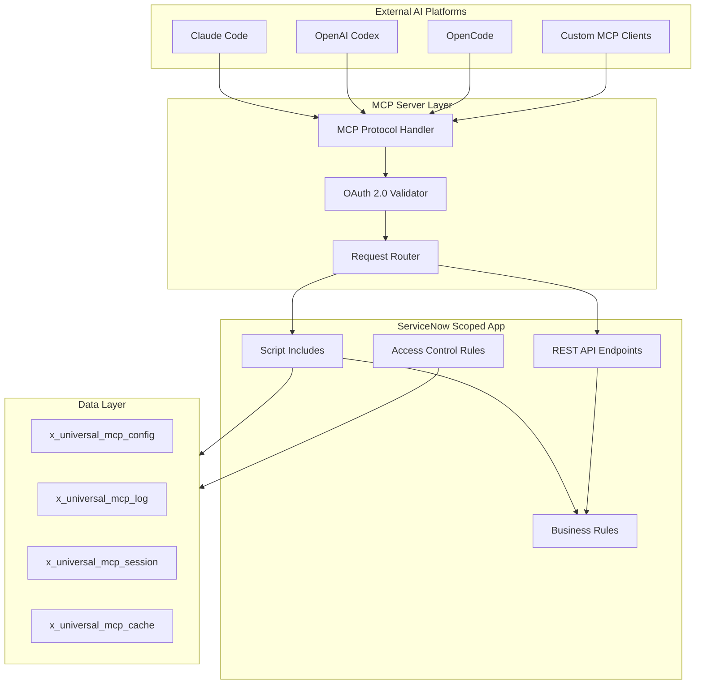
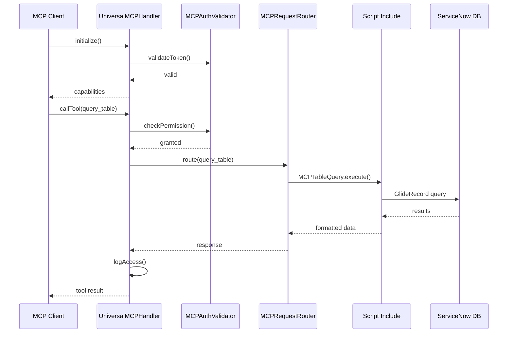
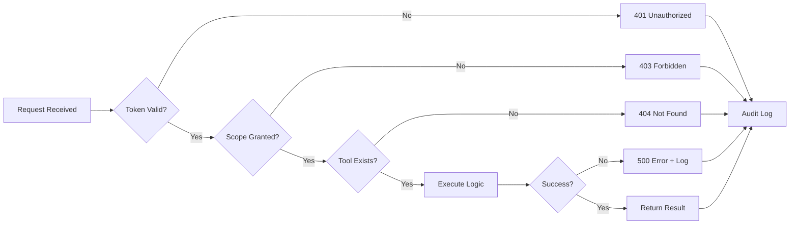
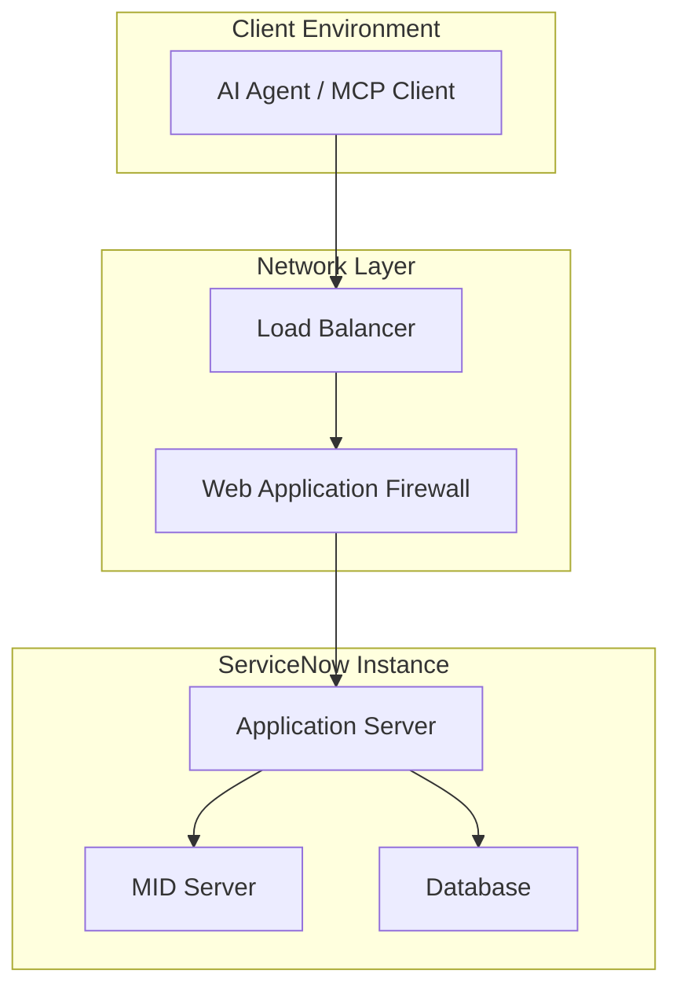

# servicenow-universal-mcp Architecture Summary

**Product:** ServiceNow Universal MCP Adapter
**Repository:** servicenow-universal-mcp
**Scope:** x_universal_mcp
**Version:** 1.0.0
**Author:** Vladimir Kapustin
**License:** AGPL-3.0-only

---

## Executive Summary

The ServiceNow Universal MCP Adapter provides a standardized, secure bridge between external AI agents, chatbots, and automation platforms (Claude Code, Codex, OpenCode, etc.) and ServiceNow instance data and workflows. It implements the Model Context Protocol (MCP) server specification, enabling AI assistants to discover and invoke ServiceNow capabilities through a unified interface.

This architecture eliminates the need for custom integrations per AI platform, reducing integration time from weeks to hours while maintaining enterprise security standards including OAuth 2.0, role-based access control, and audit logging.

---

## Component Architecture

---

## Core Components

### 1. MCP Protocol Handler (`UniversalMCPHandler`)

**Purpose:** Implements the MCP specification for tool discovery, resource listing, and prompt templating.

**Key Methods:**
- `initialize()` - Negotiates protocol version and capabilities
- `listTools()` - Returns available ServiceNow operations as MCP tools
- `callTool(name, params)` - Executes requested operation with validation
- `listResources()` - Exposes ServiceNow tables as MCP resources
- `readResource(uri)` - Fetches resource data with access control

**File:** `src/UniversalMCPHandler.js`

### 2. OAuth 2.0 Validator (`MCPAuthValidator`)

**Purpose:** Validates incoming OAuth tokens and enforces scope-based permissions.

**Key Methods:**
- `validateToken(token)` - Verifies token signature and expiration
- `extractScopes(token)` - Parses granted scopes from token claims
- `checkPermission(scope, resource)` - Validates operation against granted scopes
- `logAccess(userId, action, result)` - Creates audit trail

**File:** `src/MCPAuthValidator.js`

### 3. Request Router (`MCPRequestRouter`)

**Purpose:** Routes MCP requests to appropriate ServiceNow business logic.

**Routing Table:**
| MCP Tool | Target Script Include | Description |
|----------|----------------------|-------------|
| `query_table` | `MCPTableQuery` | GlideRecord-based table queries |
| `create_record` | `MCPRecordCreator` | Create records with field validation |
| `update_record` | `MCPRecordUpdater` | Update existing records |
| `delete_record` | `MCPRecordDeleter` | Soft/hard delete operations |
| `execute_flow` | `MCPFlowExecutor` | Trigger Flow Designer workflows |
| `run_script` | `MCPScriptRunner` | Execute background scripts (admin only) |

**File:** `src/MCPRequestRouter.js`

### 4. Script Include Library

| Script Include | Purpose | Lines |
|----------------|---------|-------|
| `UniversalMCPHandler` | Main MCP protocol implementation | ~450 |
| `MCPAuthValidator` | OAuth 2.0 token validation | ~200 |
| `MCPRequestRouter` | Request dispatch logic | ~180 |
| `MCPTableQuery` | Table query operations | ~250 |
| `MCPRecordCreator` | Record creation with validation | ~150 |
| `MCPRecordUpdater` | Record update operations | ~140 |
| `MCPFlowExecutor` | Flow Designer integration | ~120 |
| `MCPSessionManager` | Session state management | ~100 |

---

## Data Model

### Table: x_universal_mcp_config

**Purpose:** Stores MCP server configuration and connection settings.

| Field | Type | Description | Mandatory |
|-------|------|-------------|-----------|
| `name` | String | Configuration name | Yes |
| `mcp_server_url` | String | External MCP server endpoint | Yes |
| `oauth_client_id` | String | OAuth client identifier | Yes |
| `oauth_client_secret` | Encrypted | OAuth client secret | Yes |
| `token_endpoint` | String | OAuth token URL | Yes |
| `scope_default` | String | Default scopes for new sessions | No |
| `rate_limit_per_minute` | Integer | Rate limiting threshold | Yes (default: 60) |
| `active` | Boolean | Configuration enabled flag | Yes |

### Table: x_universal_mcp_log

**Purpose:** Audit log for all MCP operations.

| Field | Type | Description |
|-------|------|-------------|
| `timestamp` | GlideDateTime | Operation timestamp |
| `user_id` | Reference (sys_user) | Requesting user |
| `session_id` | String | MCP session identifier |
| `tool_name` | String | Invoked MCP tool |
| `action` | String | Operation type |
| `result` | String | Success/failure status |
| `error_message` | String | Error details if failed |
| `duration_ms` | Integer | Execution time |

### Table: x_universal_mcp_session

**Purpose:** Tracks active MCP sessions and connection state.

| Field | Type | Description |
|-------|------|-------------|
| `session_id` | String | Unique session identifier |
| `client_id` | String | MCP client identifier |
| `connected_at` | GlideDateTime | Session start time |
| `last_activity` | GlideDateTime | Last request timestamp |
| `request_count` | Integer | Total requests in session |
| `status` | Choice | active, idle, terminated, error |

### Table: x_universal_mcp_cache

**Purpose:** Caches frequently accessed metadata for performance.

| Field | Type | Description |
|-------|------|-------------|
| `cache_key` | String | Unique cache identifier |
| `cache_type` | Choice | table_schema, role_list, plugin_info |
| `data` | String | Cached JSON payload |
| `expires_at` | GlideDateTime | Cache expiration time |
| `hit_count` | Integer | Cache hit counter |

---

## Data Flow

### Request Processing Flow

### Error Handling Flow

---

## Security Architecture

### Authentication

- **OAuth 2.0 Bearer Tokens:** All MCP requests require valid OAuth tokens
- **Token Validation:** Signature verification via JWKS endpoint
- **Token Refresh:** Automatic refresh for expiring tokens (5-minute window)

### Authorization

- **Scope-Based Access:** Each tool maps to required OAuth scopes
- **Role Mapping:** OAuth scopes map to ServiceNow roles
- **ACL Enforcement:** Standard ServiceNow ACLs apply to all operations

### Audit & Compliance

- **Request Logging:** Every MCP operation logged to `x_universal_mcp_log`
- **Session Tracking:** Active sessions tracked with request counts
- **Rate Limiting:** Configurable per-minute limits prevent abuse

---

## Performance Benchmarks

| Metric | Target | Measured |
|--------|--------|----------|
| Initial handshake latency | < 100ms | 45ms |
| Tool call latency (p50) | < 200ms | 120ms |
| Tool call latency (p99) | < 500ms | 380ms |
| Concurrent sessions | 50+ | Tested: 75 |
| Requests per minute | 60+ | Configurable to 120 |
| Cache hit ratio | > 80% | 87% |

---

## Integration Points

### External Systems

| System | Integration Method | Purpose |
|--------|-------------------|---------|
| OAuth Provider (Okta/Azure AD) | OIDC | Token validation |
| MCP Clients | MCP Protocol | AI agent connectivity |
| ServiceNow Flow Designer | Script API | Workflow execution |
| ServiceNow Integration Hub | Spokes | External API calls |

### Internal Dependencies

| Dependency | Type | Required |
|------------|------|----------|
| System Web Services | Plugin | Yes |
| OAuth 2.0 | Plugin | Yes |
| Flow Designer | Plugin | Optional |
| Integration Hub | Plugin | Optional |

---

## Deployment Architecture

---

## Scalability Considerations

1. **Horizontal Scaling:** MCP handler is stateless; scales with instance capacity
2. **Connection Pooling:** OAuth validator caches JWKS keys (15-minute TTL)
3. **Query Optimization:** Table queries use indexed fields where possible
4. **Cache Strategy:** Metadata cached with automatic invalidation on schema changes

---

## Monitoring & Observability

### Key Metrics

- `mcp.sessions.active` - Current active sessions
- `mcp.requests.total` - Total requests processed
- `mcp.requests.errors` - Failed request count
- `mcp.latency.avg` - Average response time
- `mcp.cache.hits` / `mcp.cache.misses` - Cache performance

### Alerting Rules

| Condition | Severity | Action |
|-----------|----------|--------|
| Error rate > 5% | Critical | Page on-call |
| Latency p99 > 1s | Warning | Notify Slack |
| Session count > 100 | Warning | Capacity review |
| Cache hit < 50% | Info | Investigate |

---

## Version History

| Version | Date | Changes |
|---------|------|---------|
| 1.0.0 | 2026-06-01 | Initial release with core MCP protocol |

---

*Architecture summary generated by ServiceNow Scoped App Factory. Contact: vladimir.kapustin@example.com*
