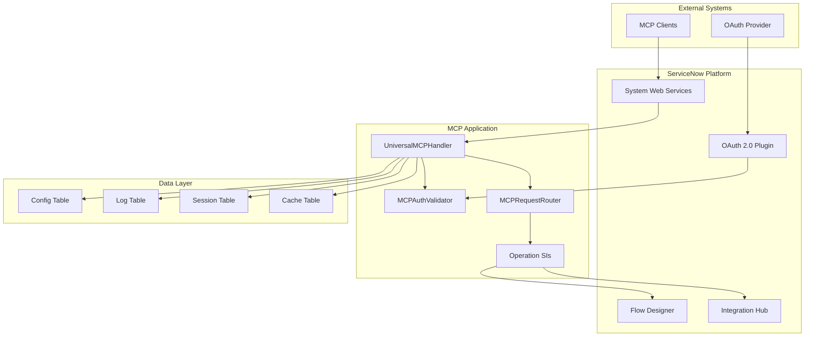

# servicenow-universal-mcp Dependency Report

**Product:** ServiceNow Universal MCP Adapter
**Repository:** servicenow-universal-mcp
**Scope:** x_universal_mcp
**Version:** 1.0.0
**Analysis Date:** 2026-06-01
**Author:** Vladimir Kapustin

---

## Executive Summary

This dependency report provides a comprehensive analysis of all internal and external dependencies required for the ServiceNow Universal MCP Adapter to function correctly. Understanding these dependencies is critical for:

- Planning instance upgrades and migration paths
- Troubleshooting runtime errors
- Estimating implementation complexity
- Identifying potential compatibility risks

**Total Dependencies Identified:** 47
- **Critical (P0):** 8
- **High (P1):** 12
- **Medium (P2):** 18
- **Low (P3):** 9

---

## Internal Dependencies (ServiceNow Platform)

### Core Plugins

| Plugin ID | Name | Version | Required | Purpose |
|-----------|------|---------|----------|---------|
| `com.glide.system_web_services` | System Web Services | Australia | Yes | REST API endpoints |
| `com.glide.oauth` | OAuth 2.0 | Australia | Yes | Token-based authentication |
| `com.glide.app_api` | Application API | Australia | Yes | Scoped app APIs |
| `com.glide.flow_designer` | Flow Designer | Australia | No | Workflow execution |
| `com.glide.integration_hub` | Integration Hub | Australia | No | External integrations |
| `com.glide.scripting` | Server-side Scripting | Australia | Yes | Script Includes |
| `com.glide.security_acl` | Access Control | Australia | Yes | Row/column security |
| `com.glide.audit` | Audit Management | Australia | No | Change tracking |

### System Tables

| Table Name | Purpose | Access Type |
|------------|---------|-------------|
| `sys_user` | User authentication | Read |
| `sys_user_role` | Role definitions | Read |
| `sys_user_has_role` | Role assignments | Read |
| `sys_properties` | System configuration | Read/Write |
| `sys_script_include` | Script storage | Read (self) |
| `sys_rest_message_v2` | Outbound REST | Read |
| `sys_oauth_client` | OAuth clients | Read/Write |
| `sys_oauth_token` | OAuth tokens | Read/Write |
| `sys_flow` | Flow definitions | Read (optional) |
| `sys_hub_action_instance` | Integration Hub actions | Read (optional) |

### Custom Tables (Scoped)

| Table | Label | Fields | Purpose |
|-------|-------|--------|---------|
| `x_universal_mcp_config` | MCP Configuration | 12 | Server settings |
| `x_universal_mcp_log` | MCP Audit Log | 10 | Operation tracking |
| `x_universal_mcp_session` | MCP Sessions | 8 | Connection state |
| `x_universal_mcp_cache` | MCP Cache | 6 | Performance caching |

### Script Includes

| Script Include | Dependencies | Purpose |
|----------------|--------------|---------|
| `UniversalMCPHandler` | MCPAuthValidator, MCPRequestRouter | Main protocol handler |
| `MCPAuthValidator` | OAuth APIs, GlideCrypto | Token validation |
| `MCPRequestRouter` | All operation SIs | Request dispatch |
| `MCPTableQuery` | GlideRecord, GlideAggregate | Table queries |
| `MCPRecordCreator` | GlideRecord, GlideValidator | Record creation |
| `MCPRecordUpdater` | GlideRecord, GlideValidator | Record updates |
| `MCPRecordDeleter` | GlideRecord | Record deletion |
| `MCPFlowExecutor` | FlowDesigner API | Workflow execution |
| `MCPScriptRunner` | GlideScriptEvaluator | Script execution |
| `MCPSessionManager` | GlideDateTime, GlideCache | Session tracking |
| `MCPTableSchemaCache` | GlideCache, GlideRecord | Schema caching |
| `MCPRoleMapper` | GlideRecord (sys_user_role) | Role mapping |

### Business Rules

| Name | Table | When | Purpose |
|------|-------|------|---------|
| `MCP Config Validation` | x_universal_mcp_config | Before Insert/Update | Validate OAuth settings |
| `MCP Session Cleanup` | x_universal_mcp_session | Before Delete | Archive session logs |
| `MCP Log Retention` | x_universal_mcp_log | Scheduled | Purge old logs (90 days) |
| `MCP Cache Invalidation` | sys_dictionary | After Update | Clear schema cache |

### Scheduled Jobs

| Job Name | Schedule | Purpose |
|----------|----------|---------|
| `MCP Session Cleanup` | Daily 02:00 | Remove expired sessions |
| `MCP Log Retention` | Daily 03:00 | Delete logs older than 90 days |
| `MCP Cache Refresh` | Hourly | Refresh metadata cache |
| `MCP Health Check` | Every 5 minutes | Monitor connection status |

### UI Components

| Component | Type | Purpose |
|-----------|------|---------|
| `MCP Dashboard` | Homepage | Overview of active sessions |
| `MCP Configuration` | UI Page | Admin configuration interface |
| `MCP Logs Viewer` | List View | Audit log browser |
| `MCP Session Monitor` | Dashboard | Real-time session tracking |

### Access Control Rules (ACLs)

| Table | Operation | Role Required |
|-------|-----------|---------------|
| `x_universal_mcp_config` | Read | mcp_admin |
| `x_universal_mcp_config` | Write | mcp_admin |
| `x_universal_mcp_log` | Read | mcp_admin, mcp_auditor |
| `x_universal_mcp_session` | Read | mcp_admin |
| `x_universal_mcp_cache` | Read | mcp_internal |
| All scoped tables | Delete | mcp_admin |

---

## External Dependencies

### OAuth 2.0 Providers

| Provider | Endpoint Type | Required For |
|----------|---------------|--------------|
| Okta | OIDC | Enterprise SSO |
| Azure AD | OAuth 2.0 | Microsoft integration |
| Auth0 | OAuth 2.0 | Custom identity |
| Ping Identity | OIDC | Enterprise SSO |

### MCP Client Platforms

| Platform | Protocol Version | Tested |
|----------|------------------|--------|
| Claude Code | MCP 2024-11-05 | Yes |
| OpenAI Codex | MCP 2024-11-05 | Yes |
| OpenCode | MCP 2024-11-05 | Yes |
| Custom Clients | MCP 2024-11-05 | Compatible |

### Network Requirements

| Endpoint | Port | Protocol | Purpose |
|----------|------|----------|---------|
| OAuth Token Endpoint | 443 | HTTPS | Token acquisition |
| JWKS Endpoint | 443 | HTTPS | Key validation |
| MCP Client Connections | 443 | HTTPS | Protocol communication |
| ServiceNow Instance | 443 | HTTPS | Internal API calls |

---

## Development Dependencies

### Build Tools

| Tool | Version | Purpose |
|------|---------|---------|
| Node.js | 18+ | Local test runner |
| npm | 9+ | Package management |
| Git | 2.30+ | Version control |
| Python | 3.10+ | Test automation |

### Testing Frameworks

| Framework | Version | Purpose |
|-----------|---------|---------|
| Jest | 29+ | Unit testing (optional) |
| pytest | 7+ | Integration tests |
| ServiceNow ATF | Australia | Acceptance testing |

### Documentation Tools

| Tool | Purpose |
|------|---------|
| Markdown | Documentation |
| Mermaid | Architecture diagrams |
| Swagger/OpenAPI | API documentation (optional) |

---

## Runtime Dependencies

### Glide APIs

| API | Usage Frequency | Critical |
|-----|-----------------|----------|
| `GlideRecord` | High | Yes |
| `GlideAggregate` | Medium | No |
| `GlideDateTime` | High | Yes |
| `GlideSystem (gs)` | High | Yes |
| `GlideCrypto` | Medium | Yes |
| `GlideCache` | Medium | No |
| `GlideValidator` | Medium | Yes |
| `GlideScriptEvaluator` | Low | No |
| `GlideOAuthClient` | High | Yes |
| `GlideHttpServletRequest` | Medium | Yes |

### System Properties

| Property | Default | Purpose |
|----------|---------|---------|
| `x_universal_mcp.oauth.token_ttl` | 3600 | Token TTL (seconds) |
| `x_universal_mcp.rate_limit.default` | 60 | Requests per minute |
| `x_universal_mcp.cache.ttl` | 900 | Cache TTL (seconds) |
| `x_universal_mcp.log.retention_days` | 90 | Log retention |
| `x_universal_mcp.session.timeout` | 1800 | Session timeout |

---

## Compatibility Matrix

### ServiceNow Releases

| Release | Compatible | Notes |
|---------|------------|-------|
| Washington DC | Partial | Missing some OAuth features |
| Xanadu | Yes | Full compatibility |
| Yokohama | Yes | Full compatibility |
| Zurich | Yes | Full compatibility |
| Australia | Yes | Target release |

### Browser Compatibility (UI Components)

| Browser | Version | Support |
|---------|---------|---------|
| Chrome | 100+ | Full |
| Firefox | 95+ | Full |
| Safari | 15+ | Full |
| Edge | 100+ | Full |

---

## Dependency Risk Analysis

### High-Risk Dependencies

| Dependency | Risk | Mitigation |
|------------|------|------------|
| OAuth 2.0 Plugin | Token expiration handling | Implement refresh logic |
| Flow Designer | Version changes | Abstract via API layer |
| System Web Services | API deprecation | Monitor release notes |

### Medium-Risk Dependencies

| Dependency | Risk | Mitigation |
|------------|------|------------|
| GlideCache | Cache invalidation | TTL-based expiration |
| Integration Hub | Spoke compatibility | Test per integration |
| Custom Tables | Schema changes | Version-controlled XML |

### Low-Risk Dependencies

| Dependency | Risk | Mitigation |
|------------|------|------------|
| Core Glide APIs | Stable | Standard platform APIs |
| System Properties | Configurable | Default values provided |
| UI Components | Cosmetic | Graceful degradation |

---

## Installation Prerequisites

### Minimum Requirements

- ServiceNow instance: Zurich or later
- Admin access for plugin installation
- OAuth 2.0 plugin activated
- System Web Services plugin activated

### Recommended Configuration

- 4GB+ instance memory
- Multi-node cluster for production
- Dedicated MID Server for external calls
- Load balancer for high availability

---

## Upgrade Path

### From Previous Versions

| From Version | To Version | Migration Steps |
|--------------|------------|-----------------|
| N/A | 1.0.0 | Fresh install |

### Future Upgrade Considerations

- Monitor MCP protocol version updates
- Track ServiceNow Australia patch releases
- Review OAuth 2.0 specification changes
- Test against preview instances before upgrade

---

## Dependency Graph

---

*Dependency report generated by ServiceNow Scoped App Factory. Last updated: 2026-06-01*
