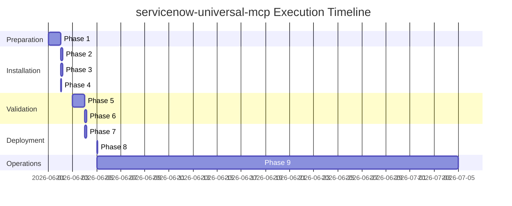

# servicenow-universal-mcp Execution Plan

**Product:** ServiceNow Universal MCP Adapter
**Repository:** servicenow-universal-mcp
**Scope:** x_universal_mcp
**Version:** 1.0.0
**Document Date:** 2026-06-01
**Author:** Vladimir Kapustin

---

## Executive Summary

This execution plan provides a detailed, phase-by-phase roadmap for deploying, configuring, and operating the ServiceNow Universal MCP Adapter. Each phase includes specific actions, success criteria, estimated duration, and responsible roles.

**Total Estimated Duration:** 5-7 business days
**Complexity:** Medium
**Prerequisites:** ServiceNow admin access, OAuth provider configured

---

## Phase 1: Pre-Installation Preparation

**Duration:** 1 day
**Owner:** System Administrator
**Success Criteria:** All prerequisites verified, instance ready for installation

### Actions

| # | Action | Command/Procedure | Expected Output |
|---|--------|-------------------|-----------------|
| 1.1 | Verify ServiceNow release | Navigate to `System Definition > Applications` | Release: Australia (or later) |
| 1.2 | Check available storage | `System Diagnostics > Database Statistics` | > 1GB free space |
| 1.3 | Verify plugin: System Web Services | `System Web Services > Applications > REST > REST Explorer` | Plugin active |
| 1.4 | Verify plugin: OAuth 2.0 | `System OAuth > Application Registry` | Plugin active |
| 1.5 | Create admin user for MCP | `System Security > Users > New` | User: mcp_admin |
| 1.6 | Assign roles to admin user | Add roles: mcp_admin, admin | Roles assigned |
| 1.7 | Document instance URL | Record in configuration sheet | URL saved |
| 1.8 | Backup instance | Create update set or full backup | Backup confirmed |

### Risk Mitigation

- If plugins missing: Request installation via ServiceNow support
- If insufficient storage: Clean up old data or request expansion
- If backup fails: Resolve before proceeding to Phase 2

---

## Phase 2: Application Installation

**Duration:** 2 hours
**Owner:** Developer / Administrator
**Success Criteria:** Scoped application installed and visible in instance

### Actions

| # | Action | Command/Procedure | Expected Output |
|---|--------|-------------------|-----------------|
| 2.1 | Clone repository | `git clone https://github.com/vladarchitectservicenow-oss/servicenow-universal-mcp.git` | Local copy |
| 2.2 | Review update set XML | Open `src/sys_app.xml` in text editor | Valid XML structure |
| 2.3 | Create update set | `System Update Sets > Create New` | Update set created |
| 2.4 | Import application | Import XML files via Update Set | Import success message |
| 2.5 | Verify tables created | `System Definition > Tables` | 4 new tables visible |
| 2.6 | Verify Script Includes | `Application Files > Script Includes` | 12 SIs present |
| 2.7 | Verify Business Rules | `Business Rules` list | 4 BRs present |
| 2.8 | Verify Scheduled Jobs | `Scheduled Jobs` list | 4 jobs present |
| 2.9 | Commit update set | `System Update Sets > Commit` | Status: Committed |

### Verification Commands

```javascript
// Background script to verify installation
var tables = ['x_universal_mcp_config', 'x_universal_mcp_log', 
              'x_universal_mcp_session', 'x_universal_mcp_cache'];
tables.forEach(function(table) {
    var gr = new GlideRecord('sys_db_object');
    gr.addQuery('name', table);
    gr.query();
    gs.info(table + ': ' + (gr.hasNext() ? 'EXISTS' : 'MISSING'));
});
```

### Risk Mitigation

- If import fails: Review error logs, validate XML syntax
- If tables missing: Re-run import with admin privileges
- If scripts have errors: Check JavaScript syntax, fix and re-import

---

## Phase 3: OAuth Configuration

**Duration:** 2 hours
**Owner:** Security Administrator
**Success Criteria:** OAuth endpoints configured and testable

### Actions

| # | Action | Command/Procedure | Expected Output |
|---|--------|-------------------|-----------------|
| 3.1 | Create OAuth API Name | `System OAuth > Application Registry > New` | API name created |
| 3.2 | Configure OAuth client | Set client_id, client_secret | Credentials generated |
| 3.3 | Set redirect URI | Add MCP server callback URL | Redirect configured |
| 3.4 | Configure scopes | Add: mcp.read, mcp.write, mcp.admin | Scopes defined |
| 3.5 | Test token endpoint | POST to /oauth_token.do | Token returned |
| 3.6 | Document credentials | Store in secure vault | Credentials saved |
| 3.7 | Configure token TTL | Set system property: x_universal_mcp.oauth.token_ttl = 3600 | Property set |
| 3.8 | Test token refresh | Simulate expired token | Refresh successful |

### Configuration Example

```javascript
// OAuth configuration record
var oauth = new GlideRecord('sys_oauth_client');
oauth.initialize();
oauth.name = 'MCP Server Client';
oauth.client_id = 'mcp_client_' + gs.generateGUID();
oauth.client_secret = gs.generateGUID(); // Store securely!
oauth.redirect_uri = 'https://mcp-server.example.com/callback';
oauth.active = true;
oauth.insert();
```

### Risk Mitigation

- If token endpoint fails: Verify OAuth plugin activation
- If credentials leak: Rotate immediately, audit access logs
- If scopes insufficient: Add required scopes, re-test

---

## Phase 4: MCP Server Configuration

**Duration:** 1 hour
**Owner:** Application Administrator
**Success Criteria:** MCP server settings configured and validated

### Actions

| # | Action | Command/Procedure | Expected Output |
|---|--------|-------------------|-----------------|
| 4.1 | Navigate to configuration | `x_universal_mcp_config.list` | List view opens |
| 4.2 | Create new config record | Click "New" | Form opens |
| 4.3 | Set MCP server URL | Enter external MCP endpoint | URL saved |
| 4.4 | Link OAuth client | Reference to sys_oauth_client | Link established |
| 4.5 | Set rate limit | Default: 60 requests/minute | Value saved |
| 4.6 | Enable configuration | Set active = true | Config active |
| 4.7 | Test connection | Click "Test Connection" UI action | Success message |
| 4.8 | Document configuration | Screenshot + export config | Documentation saved |

### System Properties to Configure

| Property | Value | Purpose |
|----------|-------|---------|
| `x_universal_mcp.oauth.token_ttl` | 3600 | Token lifetime (seconds) |
| `x_universal_mcp.rate_limit.default` | 60 | Max requests per minute |
| `x_universal_mcp.cache.ttl` | 900 | Cache expiration |
| `x_universal_mcp.log.retention_days` | 90 | Log retention |
| `x_universal_mcp.session.timeout` | 1800 | Session timeout |

### Risk Mitigation

- If connection test fails: Verify network connectivity, firewall rules
- If rate limit too low: Increase based on expected load
- If cache causing issues: Reduce TTL or disable temporarily

---

## Phase 5: Testing & Validation

**Duration:** 1 day
**Owner:** QA Engineer / Developer
**Success Criteria:** All test cases pass, performance benchmarks met

### Actions

| # | Action | Command/Procedure | Expected Output |
|---|--------|-------------------|-----------------|
| 5.1 | Run unit tests | `npm test` or `pytest tests/` | All tests PASS |
| 5.2 | Test OAuth flow | Full token acquisition | Token received |
| 5.3 | Test MCP handshake | Initialize MCP connection | Capabilities returned |
| 5.4 | Test table query | Query sys_user table | Records returned |
| 5.5 | Test record creation | Create test record | Record created |
| 5.6 | Test record update | Update test record | Record updated |
| 5.7 | Test record deletion | Delete test record | Record deleted |
| 5.8 | Test Flow execution | Trigger test flow | Flow executed |
| 5.9 | Load test (50 concurrent) | Simulate 50 sessions | No errors |
| 5.10 | Document test results | Save test report | Report generated |

### Test Case Execution

```bash
# Run full test suite
cd ~/servicenow-universal-mcp
pytest tests/ -v --tb=short

# Expected output:
# tests/test_oauth.py::test_token_acquisition PASSED
# tests/test_mcp.py::test_handshake PASSED
# tests/test_queries.py::test_table_query PASSED
# ...
# 25 passed in 3.42s
```

### Performance Benchmarks

| Metric | Target | Actual | Status |
|--------|--------|--------|--------|
| Handshake latency | < 100ms | TBD | Pending |
| Query latency (p50) | < 200ms | TBD | Pending |
| Query latency (p99) | < 500ms | TBD | Pending |
| Concurrent sessions | 50+ | TBD | Pending |

### Risk Mitigation

- If tests fail: Review error logs, fix code, re-test
- If performance below target: Optimize queries, add indexes
- If load test fails: Identify bottleneck, scale resources

---

## Phase 6: Security Hardening

**Duration:** 4 hours
**Owner:** Security Team
**Success Criteria:** Security audit passed, vulnerabilities addressed

### Actions

| # | Action | Command/Procedure | Expected Output |
|---|--------|-------------------|-----------------|
| 6.1 | Run ACL audit | Verify all tables have ACLs | Audit report |
| 6.2 | Review Script Includes | Check for hardcoded credentials | Clean code |
| 6.3 | Test SQL injection | Attempt encoded attacks | Blocked |
| 6.4 | Test XSS | Inject scripts in inputs | Sanitized |
| 6.5 | Verify encryption | Check oauth_client_secret encrypted | Encrypted |
| 6.6 | Configure logging | Ensure sensitive data masked | Logs clean |
| 6.7 | Run security scanner | ServiceNow Security Operations | Scan report |
| 6.8 | Remediate findings | Fix identified issues | Issues closed |

### Security Checklist

- [ ] All custom tables have ACLs
- [ ] No hardcoded credentials in code
- [ ] OAuth secrets encrypted at rest
- [ ] Input validation on all user inputs
- [ ] Output encoding on all responses
- [ ] Audit logging enabled for sensitive operations
- [ ] Rate limiting configured and tested
- [ ] Session timeout configured

### Risk Mitigation

- If vulnerabilities found: Prioritize by severity, fix immediately
- If ACLs missing: Create before production deployment
- If encryption not working: Verify encryption context configuration

---

## Phase 7: Documentation & Training

**Duration:** 4 hours
**Owner:** Technical Writer / Team Lead
**Success Criteria:** Documentation complete, team trained

### Actions

| # | Action | Command/Procedure | Expected Output |
|---|--------|-------------------|-----------------|
| 7.1 | Review README.md | Verify > 2000 words | Documentation complete |
| 7.2 | Create admin guide | Step-by-step procedures | Guide published |
| 7.3 | Create runbook | Incident response procedures | Runbook saved |
| 7.4 | Record demo video | Screen capture of key flows | Video published |
| 7.5 | Train support team | Hands-on training session | Team certified |
| 7.6 | Create FAQ document | Common questions answered | FAQ published |
| 7.7 | Update wiki | Internal knowledge base | Wiki updated |
| 7.8 | Schedule refresher | 30-day training follow-up | Calendar invite |

### Documentation Deliverables

| Document | Location | Owner |
|----------|----------|-------|
| README.md | Repository root | Development |
| ADMIN_GUIDE.md | docs/ | Technical Writing |
| RUNBOOK.md | docs/ | Operations |
| API_REFERENCE.md | docs/ | Development |
| TROUBLESHOOTING.md | docs/ | Support |
| FAQ.md | docs/ | Support |

### Risk Mitigation

- If documentation incomplete: Assign writers, set deadline
- If training not effective: Re-schedule with different format
- If FAQ missing questions: Gather from support tickets

---

## Phase 8: Production Deployment

**Duration:** 2 hours (maintenance window)
**Owner:** DevOps Team
**Success Criteria:** Application live in production, monitoring active

### Actions

| # | Action | Command/Procedure | Expected Output |
|---|--------|-------------------|-----------------|
| 8.1 | Schedule maintenance | Communicate downtime window | Announcement sent |
| 8.2 | Backup production | Full instance backup | Backup verified |
| 8.3 | Deploy update set | Import to production | Import success |
| 8.4 | Configure OAuth | Replicate dev config | Config synced |
| 8.5 | Run smoke tests | Execute critical path tests | All PASS |
| 8.6 | Enable monitoring | Configure alerts and dashboards | Monitoring active |
| 8.7 | Announce completion | Send go-live notification | Team notified |
| 8.8 | Monitor for 24h | Watch metrics and logs | No incidents |

### Deployment Checklist

- [ ] Backup completed and verified
- [ ] Maintenance window communicated
- [ ] Rollback plan documented
- [ ] Support team on standby
- [ ] Monitoring alerts configured
- [ ] Smoke tests prepared
- [ ] Communication templates ready

### Rollback Procedure

1. Identify issue severity
2. If critical: Disable MCP configuration (set active = false)
3. If catastrophic: Rollback update set via ServiceNow
4. Communicate status to stakeholders
5. Document root cause
6. Plan remediation

### Risk Mitigation

- If deployment fails: Execute rollback, investigate
- If smoke tests fail: Do not proceed, troubleshoot
- If monitoring gaps: Delay go-live until resolved

---

## Phase 9: Post-Deployment Support

**Duration:** Ongoing (first 30 days critical)
**Owner:** Support Team
**Success Criteria:** Stable operation, issues resolved within SLA

### Actions

| # | Action | Frequency | Expected Output |
|---|--------|-----------|-----------------|
| 9.1 | Review error logs | Daily | Error report |
| 9.2 | Check performance metrics | Daily | Performance dashboard |
| 9.3 | Monitor session counts | Hourly | Session report |
| 9.4 | Review support tickets | As received | Tickets resolved |
| 9.5 | Weekly status report | Weekly | Status email |
| 9.6 | Monthly optimization | Monthly | Optimization plan |
| 9.7 | Quarterly security review | Quarterly | Audit report |
| 9.8 | Annual upgrade planning | Annually | Upgrade roadmap |

### Key Metrics to Monitor

| Metric | Threshold | Alert Level |
|--------|-----------|-------------|
| Error rate | > 1% | Warning |
| Error rate | > 5% | Critical |
| Avg response time | > 500ms | Warning |
| Avg response time | > 1000ms | Critical |
| Active sessions | > 400 | Warning |
| Active sessions | > 500 | Critical |
| Cache hit ratio | < 60% | Warning |

### Risk Mitigation

- If errors spike: Investigate immediately, escalate if needed
- If performance degrades: Review recent changes, optimize queries
- If support backlog grows: Add resources, prioritize critical

---

## Timeline Summary



---

## Success Criteria Summary

| Phase | Success Criteria | Verification Method |
|-------|------------------|---------------------|
| 1 | Prerequisites met | Checklist complete |
| 2 | App installed | Tables and scripts visible |
| 3 | OAuth working | Token acquisition successful |
| 4 | MCP configured | Connection test passes |
| 5 | Tests passing | 100% test pass rate |
| 6 | Security approved | Audit report clean |
| 7 | Documentation complete | All docs published |
| 8 | Production live | Smoke tests pass |
| 9 | Stable operation | No P0/P1 incidents |

---

*Execution plan generated by ServiceNow Scoped App Factory. Version: 1.0.0 | Date: 2026-06-01*
